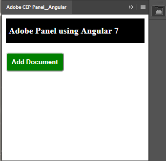

Adobe CEP Panel using Angular 7
=======================

Demo of the bulding a Adobe CEP Extension using Angular 7 as the UI framework. This approach allows us to build reusable components which can be used across multiple Adobe extensions.



## Features
This is just a showcase of building Adobe Extension panels using latest frameworks like Angular 7, React, Vue.

From Components we can connect to Adobe CSInterface and  execute jsx scripts.
<!--
    Example

```
   const script = 'app.documents.add()';
    new CSInterface().evalScript(script, (result) => {
      alert('Document added using panel extension');
    });
```
-->

## Related Approach
Please refer to [this article](http://www.davidebarranca.com/?p=2672) for more details on how to build an extension using TypeScript.

 Using the folder structure approach given in the above link, we can connect with Angular to build Adobe Panel extensions used by community.

## Issues
If you don't find the extension is running, try to change the relative path in index.html file to complete path.

You can tweet me at this link for more information.[NaviMarella](https://twitter.com/NaviMarella)

## Installation
Please see the shared [installation instruction](../../README.md#installation).

## Changelog
**V1.0** Dec 2018.
