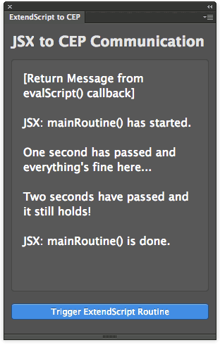

ExtendScript CEP Events
=======================

Demo of the CEP5 ExternalObject library that allows ExtendScript to dispatch Custom CSXSEvents, to be listened by HTML Panels.

## Features
Click the button and wait for the JSX to dispatch Custom Events - which payloads is logged in the Panel.

It demonstrates how to load the `PlugPlugExternalObject`, create and dispatch a custom `CSXSEvent` (with a payload) and listen for it in the HTML Panel.

##Related Blogpost
Please refer to [this article](http://www.davidebarranca.com/?p=2672) for a commented version of the code.

## Issues
For some reason the messages aren't updated as soon as they arrive, but all at the same time - and only after the whole JSX routine is done.

Moreover, the first log is the returned value from the routine, handled by the evalScript() callback: which as far as I understand should be the last one.

## Installation
Please see the shared [installation instruction](../../README.md#installation).

## Changelog
**V1.0** July 2014.