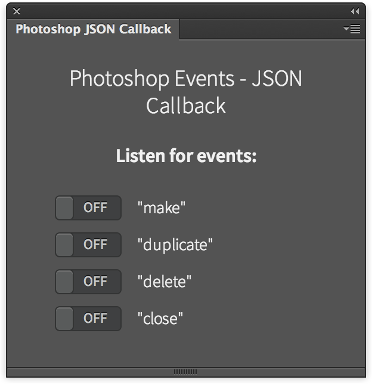

Photoshop JSON Callback
=======================

Shows the new way to listen to Photoshop events in a panel, via com.adobe.PhotoshopJSONCallback

## Features
Switch on some switches, and the referring (stringID) Photoshop event is going to be listen. Check the debug console for messages.

## Installation
Please see the shared [installation instruction](../../README.md#installation) (and don't forget the Debug flag!)

##Related Blogpost
Please refer to [this article](http://www.davidebarranca.com/2015/09/html-panel-tips-18-photoshop-json-callback/) for a commented version of the code.

## Changelog
**V1.0** September 2015.