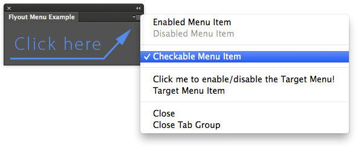

Flyout Menu
===========

Implements Flyout Menus in HTML Panels.

## Features
Flyout menu set via XML string, with nested items (still not working in PS CC 2014.2.0 - work on After Effects though).

Demoes:

- enabled items
- disabled items
- checkable items
- click handler callback
- menu updating (enable/disable, checked/unchecked)
## Installation
Please see the shared [installation instruction](../../README.md#installation) (and don't forget the Debug flag!)

##Related Blogpost
Please refer to [this article](http://www.davidebarranca.com/?p=2732) for a commented version of the code

## Changelog
**V1.0** October 2014.