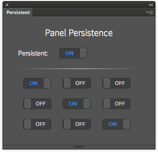

Photoshop Persistent
====================

Demonstration of GUI persistence via PhotoshopPersistent Event dispatching.

## Features
Switch on some switched, then close and reopen the panel - they reset.
Switch on the Persistent switch before, then play with the other ones; when you close and reopen the panel, the same configuration appears.

## Installation
Please see the shared [installation instruction](../../README.md#installation) (and don't forget the Debug flag!)

##Related Blogpost
Please refer to [this article](http://www.davidebarranca.com/2014/02/html-panels-tips-9-persistence/) for a commented version of the code

## Changelog
**V1.0** February 2014.