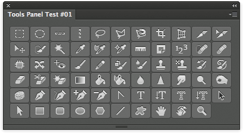

Photoshop Tools Panel #1
========================

Contains all 65 selectable tools in the Photoshop CC 2014 Tools palette. 



## Purpose
I've built it to test an **Adobe Configurator**-like panel: one of the Configurator's feature was to let users compose a panel with selectable Tools - this first attempt **is just a study** with all the Tools together.

Even if I plan to build **Templates** targeted to non-coders in the future, this one isn't - think about it more like a way to prove myself it can be done ;-)

## Features
Just click any of the buttons to have that tool selected.

## Installation
Please see the shared [installation instruction](../../README.md#installation).

## Code
The code is surprisingly minimal! My first attempt with Angular.js - the panel revolves around a directive in the [app.js](js/app.js) file:

```JavaScript
app.directive('psTools', function () {
	return {
		restrict: 'E',
		replace: true,
		// seems like ToolTip doesn't work as button's title :-(
		template: '<button class="topcoat-icon-button" ng-click="selectTool()" title="{{toolTip}}">\
						<span class="ps-icon {{type}}"></span>\
				   </button>',
		link: function($scope, $element, $attrs) {
			$scope.type = $attrs.type;
			if ($attrs.idx) {
				$scope.toolTip = $scope.psToolsModel[$attrs.idx].toolTip;
			}
			// calls the selection function in JSX
			$scope.selectTool = function() { 
				$scope.csInterface.evalScript("selectTool('" + $scope.type + "')");
			};
		}
	}
});
```

I then use an `$http.get()` to load a *local* JSON file containing objects for all the StringIDs. 

Thanks God CEF doesn't fire a *XMLHttpRequest* error, like Google Chrome does if you try that. In case you're wondering, you can force it, launching the Chrome app with this flag `--new --args -allow-file-access-from-files`.

Eventually, a simple JSX function that perform the actual tool selection is run when the user clicks a button - which in turns is passed the tool's StringID.

## Issues
For some reason, Button ToolTips do not work :-/ They are in the form of `title` attribute but CEF has problems rendering them, apparently.

## TODO
Too many things to list them ;-)
But first and foremost, I'd like to implement some form of **toggle buttons** (you click one, and it stays pressed). I'll probably go with Radio Buttons in disguise, but I wanted to start easy.

## Changelog
**V0.1** June 2014.