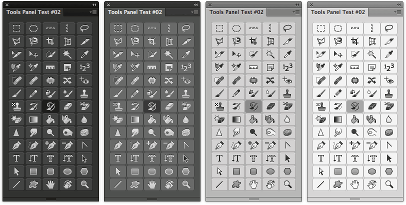

Photoshop Tools Panel #2
========================

**Evolution of the #1** - Contains all 65 selectable tools in the Photoshop CC 2014 Tools palette.
Available on Adobe Add-ons as [PS Tools 0.1.0](https://creative.adobe.com/addons/products/2603) (now updated).



## Features
Just click any of the buttons to have that tool selected.

This HTML Panel uses a modified version of Topcoat CSS (4 CSS instead of the original 2) and Angular JS.

## Installation
Please see the shared [installation instruction](../../README.md#installation) (and don't forget the Debug flag!)

## Improvements
Compared to #1, Buttons have now been implemented as Radio Buttons: this meant some extra work on the Angular Controller in order to let the panel automatically select the "currently selected tool" when it's open the first time. (see the function in Photoshop.jsx)

See the Photoshop Tools Panel #1 [Readme](../com.undavide.tools1/README.md) for more information on the Angular Directive used.

Note: this time I've got to use `$parent` to access the parent scope from the `ng-model` in the input element. Also, a `<div>` wraps `<input>` and `<label>`  because Angular Directives don't like to contain more than one element.

Moreover, I've added in the CSS files a `topcoat-toggle` class:

```CSS
input[type=radio].topcoat-toggle:checked + label {
	background-color: #3C3C3C; 
	box-shadow: none;
}
```

which extends original Topcoat set.

## Issues
Like in #1 Button ToolTips do not work :-/ They are in the form of `title` attribute but CEF has problems rendering them, apparently.

So far `topcoat-toggle` has been added in the 4 custom Topcoat CSS, but I'd like to find a way to extend them separately in the future. 

## Changelog
**V0.1** 25 June 2014.