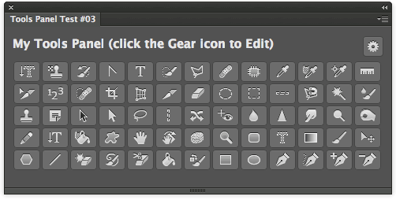
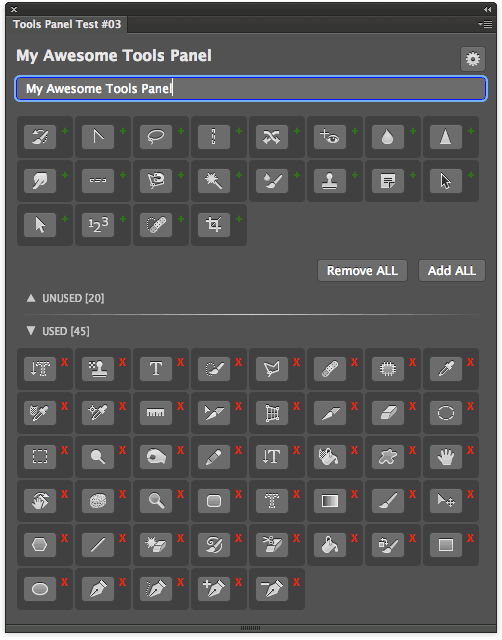

Photoshop Tools Panel #3
========================

All Photoshop Tools - Editable HTML Panel.
Available on Adobe Add-ons as [PS Tools 0.2.0](https://creative.adobe.com/addons/products/2603).

## Features
Just click any of the buttons to have that tool selected.

Click the Gear icon (top right corner) to enter the new **Edit Mode**.

You can:

1. Rename the panel's title (from the text-area below it).
2. Remove/Add tools, clicking either on the X or the + icon; Remove All and Add All buttons are provided.

Click the Gear icon to apply changes (which are permanent and will stick between sessions).

## Installation
Please see the shared [installation instruction](../../README.md#installation) (and don't forget the Debug flag!)

## Improvements
Lot of fun with Angular JS. This might be the base for other elements such as Script and Action Buttons.

## Issues
Some people (myself included) won't see the Panel's title updated as soon as they type in the text-area. As a workaround, add an extra white space and the cancel (backspace) it. This will trigger the correct binding.

## Changelog
Added 12 July 2014.